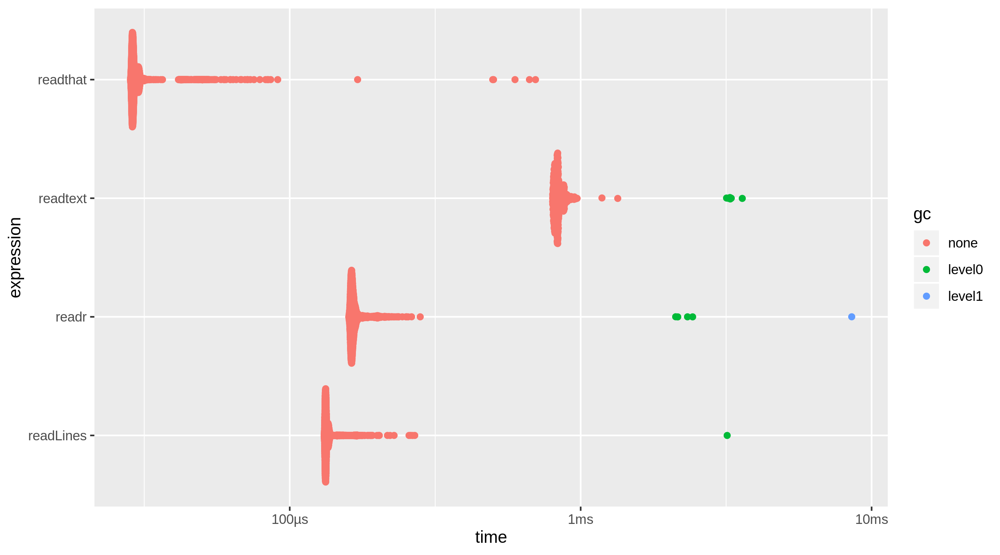
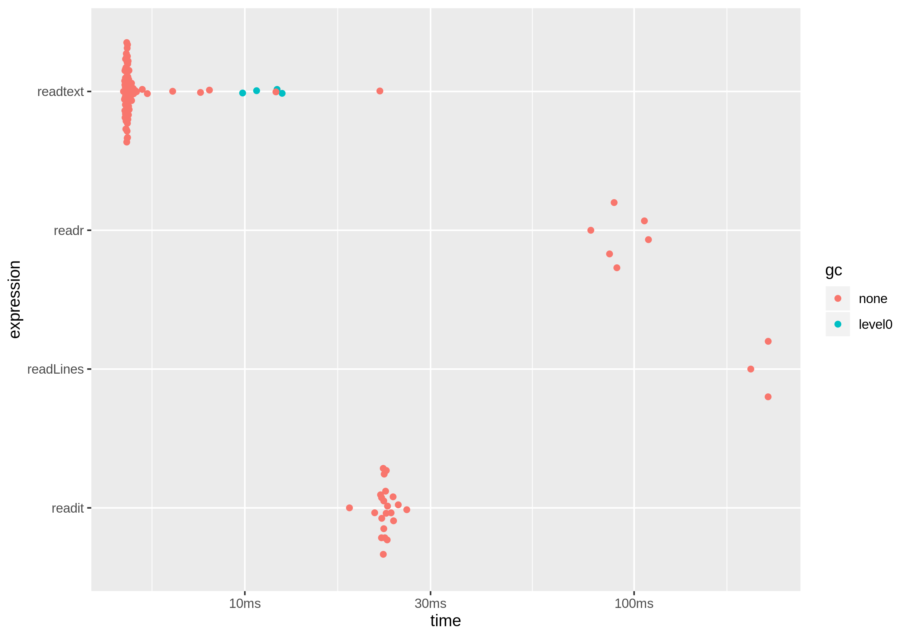

<!-- README.md is generated from README.Rmd. Please edit that file -->

```{r, include = FALSE}
knitr::opts_chunk$set(
  collapse = TRUE,
  comment = "#>",
  fig.path = "man/figures/README-",
  out.width = "100%"
)
```

# readthat

<!-- badges: start -->
[](https://CRAN.R-project.org/package=readthat)
[](https://www.tidyverse.org/lifecycle/#experimental)
<!-- badges: end -->

Quickly read text/source from local files and web pages.

## Installation

You can install the development released version of readthat from Github with:

``` r
remotes::install_github("mkearney/readthat")
```

## Comparisons

Benchmark comparison for reading a text file:

``` r
x <- "~/Dropbox/data.txt"
bm_file <- bench::mark(
  readthat = readthatcpp(x),
  readLines = readLines(x),
  readtext = readtext::readtext(x),
  readr = readr::read_lines(x),
  check = FALSE
)
#> # A tibble: 4 x 13
#>   expression     min  median `itr/sec` mem_alloc `gc/sec` n_itr  n_gc total_time
#>   <bch:expr> <bch:t> <bch:t>     <dbl> <bch:byt>    <dbl> <int> <dbl>   <bch:tm>
#> 1 readthat      37.1µs  38.3µs    25547.    2.49KB    10.2   9996     4      391ms
#> 2 readLines  132.9µs   137µs     7149.    12.7KB     2.02  3539     1      495ms
#> 3 readtext   808.4µs 825.4µs     1199.    4.74MB    10.5    572     5      477ms
#> 4 readr      163.8µs   169µs     5766.    2.58MB    10.4   2777     5      482ms
#> # … with 4 more variables: result <list>, memory <list>, time <list>, gc <list>
```




Benchmark comparison for reading a web page:

``` r
x <- "https://mikewk.com/post/2019-04-23-three-things-to-know-beyond-base-r/index.html"
bm_html <- bench::mark(
  readthat = readthatcpp(x),
  readLines = readLines(x),
  readtext = readtext::readtext(x),
  readr = readr::read_lines(x),
  check = FALSE
)
#> # A tibble: 4 x 13
#>   expression      min   median `itr/sec` mem_alloc `gc/sec` n_itr  n_gc total_time
#>   <bch:expr> <bch:tm> <bch:tm>     <dbl> <bch:byt>    <dbl> <int> <dbl>   <bch:tm>
#> 1 readthat      18.57ms  22.85ms     43.6     35.6KB     0       22     0      505ms
#> 2 readLines  199.43ms 220.94ms      4.68    11.3KB     0        3     0      641ms
#> 3 readtext     4.88ms   4.99ms    186.     621.6KB     8.74    85     4      458ms
#> 4 readr       77.41ms  89.58ms     10.7      169KB     0        6     0      558ms
#> # … with 4 more variables: result <list>, memory <list>, time <list>, gc <list>
```


