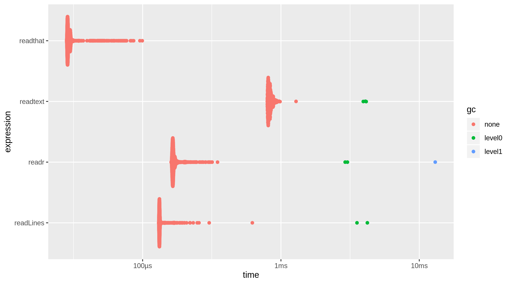
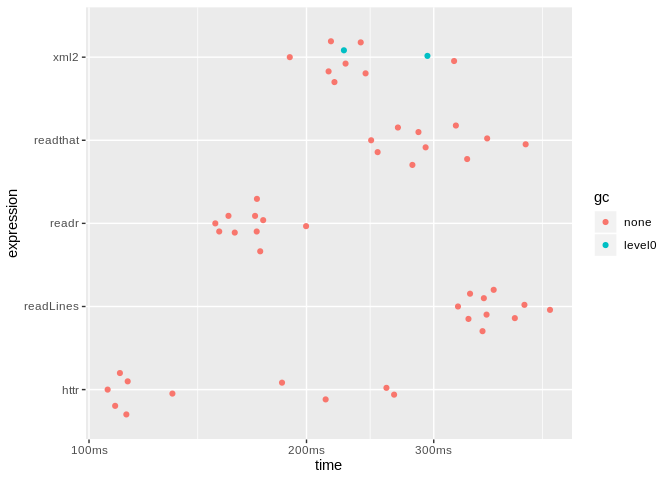

<!-- README.md is generated from README.Rmd. Please edit that file -->

# readthat

<!-- badges: start -->

[](https://CRAN.R-project.org/package=readthat)
[](https://www.tidyverse.org/lifecycle/#experimental)
<!-- badges: end -->

Quickly read text/source from local files and web pages.

## Installation

You can install the development released version of readthat from Github
with:

``` r
remotes::install_github("mkearney/readthat")
```

## Comparisons

Benchmark comparison for reading a text file:

``` r
x <- "~/Dropbox/data.txt"
bm_file <- bench::mark(
  readtext = readtext::readtext(x),
  readr = readr::read_lines(x),
  readthat = readthat(x),
  readLines = readLines(x),
  check = FALSE
)
bm_file
#> # A tibble: 4 x 6
#>   expression      min   median `itr/sec` mem_alloc `gc/sec`
#>   <bch:expr> <bch:tm> <bch:tm>     <dbl> <bch:byt>    <dbl>
#> 1 readtext    794.1µs  821.3µs     1212.    5.38MB    12.5 
#> 2 readr       157.2µs  161.8µs     6053.    2.69MB    10.4 
#> 3 readthat     28.2µs   28.7µs    33863.   21.69KB     0   
#> 4 readLines   130.8µs  132.6µs     7424.   10.54KB     2.01
```



Benchmark comparison for reading a web page:

``` r
x <- "https://www.espn.com/nfl/scoreboard"
bm_html <- bench::mark(
  httr = httr::content(httr::GET(x), as = "text", encoding = "UTF-8"),
  xml2 = xml2::read_html(x),
  readthat = readthat(x),
  readLines = readLines(x, warn = FALSE),
  readr = readr::read_lines(x),
  check = FALSE,
  iterations = 10
)
bm_html
#> # A tibble: 5 x 6
#>   expression      min   median `itr/sec` mem_alloc `gc/sec`
#>   <bch:expr> <bch:tm> <bch:tm>     <dbl> <bch:byt>    <dbl>
#> 1 httr          102ms    169ms      5.18    2.82MB    0.576
#> 2 xml2          194ms    242ms      4.10    1.86MB    1.76 
#> 3 readthat      180ms    296ms      3.28  635.16KB    0    
#> 4 readLines     302ms    363ms      2.47  633.88KB    0    
#> 5 readr         162ms    191ms      4.89  827.15KB    0
```


